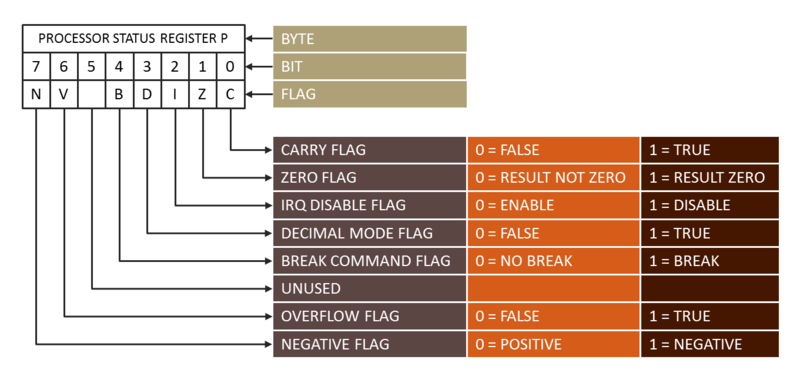

# nes-course
Learning about NES development and 6502 Assembly


## Binary

LSB
MSB

we represent binary numbers by using `%` => `%00010110`

## Hexadecimal

Nible 4 bits

$00011011$

to represent this decimal number we can break a 8 bit (byte) into 2 nibbles

$0001$  $1011$

$$
0001 \Rightarrow 1
$$ 

$$

1011_{2}\Rightarrow 1*2^3 + 0*2^2 + 1*2^1 + 1*2^0 = 8 + 0 + 2 + 1 = 11_{10} = B_{16}
$$

$1B_{16} = 00011011_{2}$

this way we can display large binary numbers with few digits 

we represent hex numbers by using a `$` => `$3F`


`#2` => literal decimal 2
`$2F` => hex number
`%01001011` => binary number

## 6502 by Ricoh

An important circuit called BCD (binary-coded decimal) was disabled

it has an APU (Audio Processing Unit)

DMA controller


IRQ => Interruption Request

if a pin has a bar on top it means it works in a reversed order meaning if we send 0 that pin will be activated

NMI => non-maskable interrupt

SO => Set Overflow

R/W => Read or Write (from processor to the memory)

D0 ~ D7 => Data pins (8bits) $2^8 = 256$

A0 ~ A15 => Address pins (16bits) $2^{16} = 65536$


#### Registers

8bits:
A => accumulator
X register (indexed registers)
Y register (indexed registers)

ALU => Arithmetic Logic Unit -> the accumulator is connected to it

Stack Pointer => holds the lowest byte to the pointer of the top of the stack, in other words it points to the top of the stack

Processor Flags => status flag of the previous operation

16bits:
Program Counter => points to the address of the next instruction


#### Processor Flags

Those flags get set based on the previous instruction



##### C - Carry Flag

Happens when we add thigs together and a carry occurs
1 = True (carry happened) 0 = False

for example we want to add $11111111 + 00000001$ we would need to have an extra place on the left to hold the resulting number $1 00000000$

that one that's beyond 8 bits we have a carry at the end therefore we set the carry flag to 1

##### Z - Zero Flag

Was the result of the last operation zero? 0 = NOT ZERO (false) 1 = ZERO (true)
##### I - IRQ Disabled Flag
?
##### D - Decimal mode (DCF) flag (disabled on Nintendo's processor)
Disabled on Nintendo's processor

##### B - Break Flag
Wherever we receive a break was caused by an interrupt

##### V - OVerflow Flag
Overflow happens when we overflow a number by adding numbers we flip their sign

$\;\;\;\;\:
\begin{array}{|c|c|c|c|c|c|c|c|}
\hline
0 & 1 & 1 & 1 & 1 & 1 & 1 & 1\\
\hline
\end{array} = 127_{10}\\
$

$+\:\:
\begin{array}{|c|c|c|c|c|c|c|c|}
\hline
0 & 0 & 0 & 0 & 0 & 0 & 0 & 1\\
\hline
\end{array} = 1_{10}\\
$

$=\:
\begin{array}{|c|c|c|c|c|c|c|c|}
\hline
1 & 0 & 0 & 0 & 0 & 0 & 0 & 0\\
\hline
\end{array} = -128_{10}\\
$


##### N - Negative Flag
1 = True (result is negative) 0 = False

`Sign & Magnitude` has a huge problem with this technique because it generates two ways to represent the value `0`

The technique utilized is `Two's complement`

Normal 8bit binary:

$
\begin{array}{|c|c|c|c|c|c|c|c|}
\hline
128 & 64 & 32 & 16 & 8 & 4 & 2 & 1\\
\hline
\end{array}
$

Two's complement 

$
\begin{array}{|c|c|c|c|c|c|c|c|}
\hline
-128 & 64 & 32 & 16 & 8 & 4 & 2 & 1\\
\hline
\end{array}
$

the last colum tells us how many -128 we have, for exaple here we have 127 (positive)

$
\begin{array}{|c|c|c|c|c|c|c|c|}
\hline
-128 & 64 & 32 & 16 & 8 & 4 & 2 & 1\\
\hline
0 & 1 & 1 & 1 & 1 & 1 & 1 & 1\\
\hline
\end{array}
= 127 \rightarrow \mathrm{7F_{hex}}
$

Here we have -128 given that we only have that bit turned on and the rest is 0 meaning we don't sum the values that we can return for each column

$
\begin{array}{|c|c|c|c|c|c|c|c|}
\hline
-128 & 64 & 32 & 16 & 8 & 4 & 2 & 1\\
\hline
1 & 0 & 0 & 0 & 0 & 0 & 0 & 0\\
\hline
\end{array}
= -128 \rightarrow \mathrm{80_{hex}}
$

to make it more clear let's see how -1 is represented

$
\begin{array}{|c|c|c|c|c|c|c|c|}
\hline
-128 & 64 & 32 & 16 & 8 & 4 & 2 & 1\\
\hline
1 & 1 & 1 & 1 & 1 & 1 & 1 & 1\\
\hline
\end{array}
= -1 \rightarrow \mathrm{FF_{hex}}
$

this is the same as $-128 + 64 + 32 + 16 + 8 + 4 + 2 + 1 = -1$

## Assembler Flow

```s
; How do we tell the processor that we want to lead the value #2 into the A register
; opcode  A9 02 -> processor

LDA #2
```

this will generate the code `A9 02`


NES is a little endian

### Big Endian:
Most significant value in the sequence is store first, thus by the `big eng`

### Little Endian:
Least significant bytes are stored first, thus by the `little end`


Problem with those differences is when you have one computer comunicating with another
they need to have an agreement on which order the bits are read

`LDX $1234`

$\Downarrow\\$

`AE 34 12`


### 6502 Instruction Set

#### Load and Store Instructions
```
LDA ; load the A register
LDX ; load the X register
LDY ; lead the Y register

STA ; store the A register into a memory pos
STX ; store the X register into a memory pos
STY ; store the Y register into a memory pos
```
#### Arithmetic Instructions (add, subtract)

We only have addition and subtraction operations

```
ADC ; add to the accumulator
    ; (with carry)

SBC ; subtract from the accumulator
    ; (with carry)
```

Both add and subtract implement the carry flag.

`CLC` clears the carry flag, usually performed before addition
`SEC` set the carry flag, usually performed before subtraction

#### Increment and Decrement

```
INC ; increment memory by one
INX ; increment X by one
INY ; increment Y by one

DEC ; decrement memory by one
DEX ; decrement X by one
DEY ; decrement Y by one
```

Z=1 if the result is zero, 0 otherwise
N=1 if the bit 7 (sign bit) is 1, 0 otherwise


#### Instructions to Jump & Branches

```
JMP ; Jump to another location --> GOTO
```

#### LD65 and CA65

`CA65` is the compiler that generates `.o` files

after generating our `.o` files we need to link them together with `LD65`
to generate a final `.nes` ROM

but the link needs a configuration file called `nes.cfg`

it has the `memory` layout and the `segments`